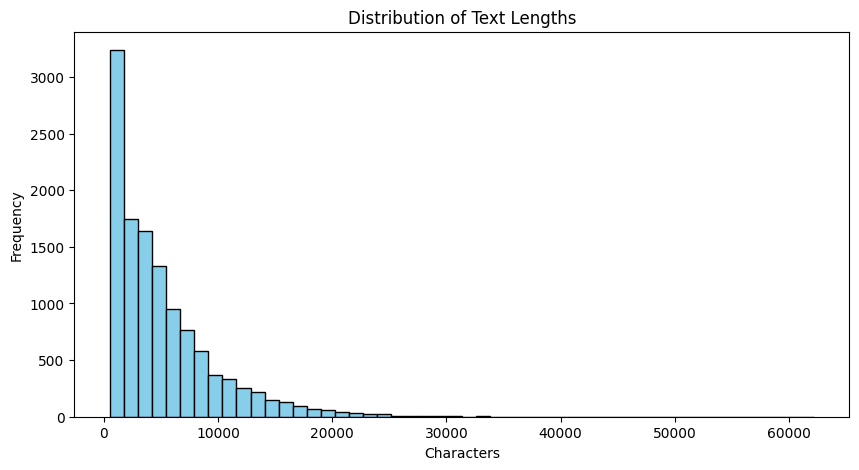
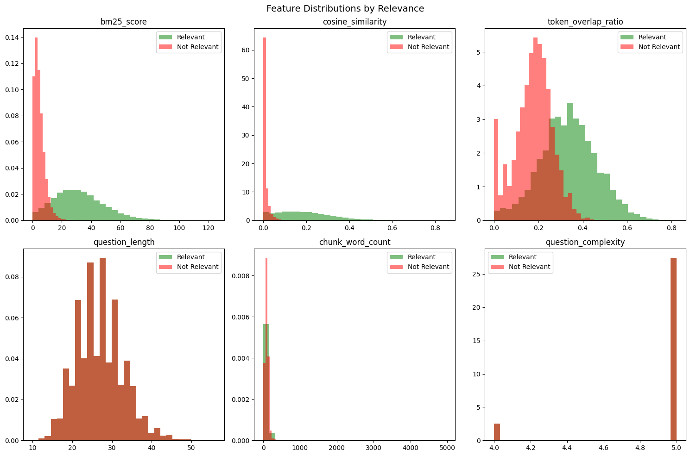
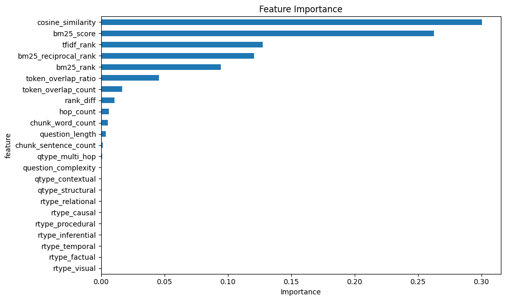
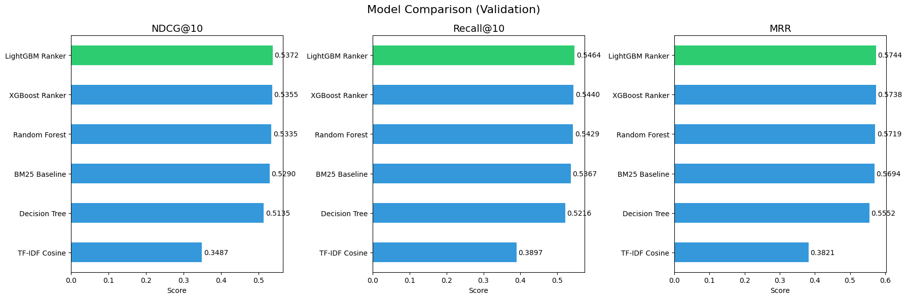
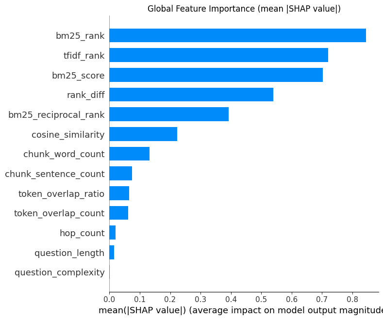
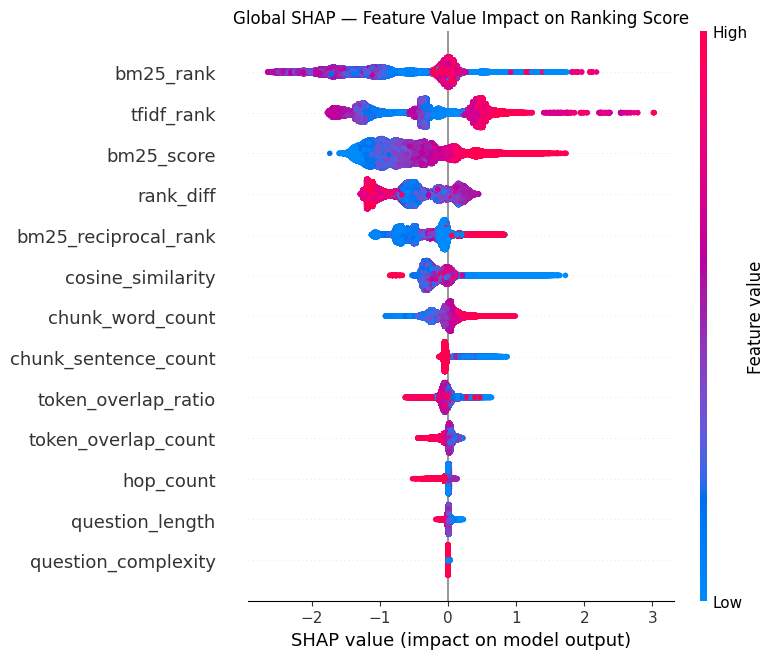
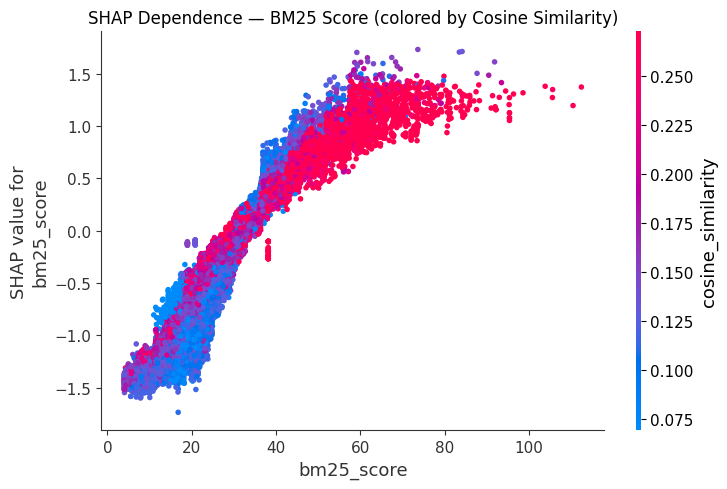
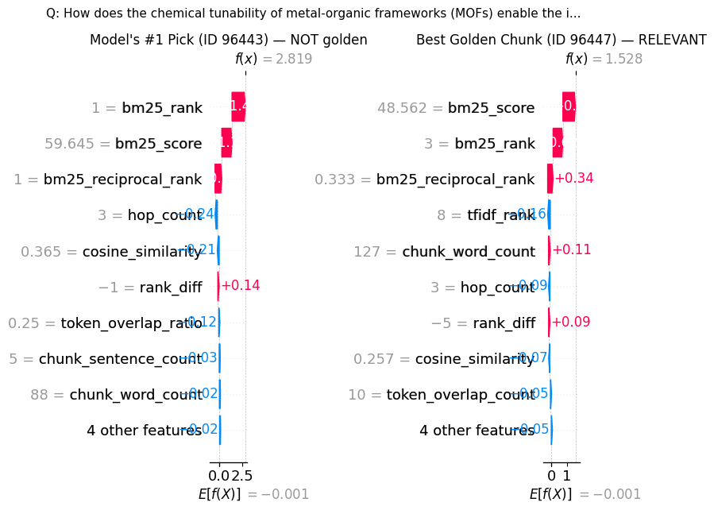

# NVDocs_RAG
# RAG Retrieval on NVIDIA NVDocs

A retrieval-augmented generation (RAG) pipeline that retrieves relevant document chunks for a given question using sparse retrieval (BM25 + TF-IDF) and re-ranks candidates with gradient-boosted tree models (XGBoost, LightGBM). Built on NVIDIA's synthetic [Retrieval-Synthetic-NVDocs-v1](https://huggingface.co/datasets/nvidia/Retrieval-Synthetic-NVDocs-v1) dataset.

## Pipeline Overview

1. **Retrieval** — BM25 and TF-IDF indexes retrieve top-100 candidates each, merged into a union pool
2. **Feature Engineering** — 14 features computed per (question, chunk) pair
3. **Re-Ranking** — Trained LambdaMART ranker scores and re-orders candidates
4. **Output** — Top-5 chunks returned as context for generation

## Dataset

- **Source:** `nvidia/Retrieval-Synthetic-NVDocs-v1` (HuggingFace)
- **~192k** document chunks, **~84k** QA pairs
- **Split:** 80/10/10 train/val/test (no document overlap between splits)



## Features

14 features computed per (question, chunk) pair:

| Feature | Description |
|---------|-------------|
| `bm25_score` | BM25 relevance score |
| `cosine_similarity` | TF-IDF cosine similarity |
| `token_overlap_ratio` | \|Q ∩ C\| / \|Q\| |
| `token_overlap_count` | \|Q ∩ C\| |
| `question_length` | Word count |
| `chunk_word_count` | Chunk word count |
| `chunk_sentence_count` | Chunk sentence count |
| `question_complexity` | QA metadata |
| `hop_count` | QA metadata |
| `bm25_rank` | Per-question BM25 rank |
| `tfidf_rank` | Per-question TF-IDF rank |
| `bm25_reciprocal_rank` | 1 / bm25_rank |
| `rank_diff` | bm25_rank - tfidf_rank |

Query type and reasoning type one-hot features were dropped — they had <1% importance.





## Models Trained

| Model | Type |
|-------|------|
| BM25 Baseline | Raw BM25 scores |
| TF-IDF Baseline | Cosine similarity |
| Decision Tree | max_depth=10 |
| Random Forest | 200 trees, max_depth=15 |
| XGBoost Ranker | rank:ndcg, 300 trees |
| LightGBM Ranker | LambdaMART, 300 trees |

Key training decision: models train on **hard negatives** (BM25∪TF-IDF top-100 candidates) rather than random negatives, matching the evaluation distribution. Golden chunks are injected during training only.

## Results

### Test Set Performance

| Model | NDCG@10 | Recall@10 | MRR | MAP |
|-------|---------|-----------|-----|-----|
| BM25 Baseline | 0.5227 | 0.5367 | 0.5694 | 0.4747 |
| TF-IDF Cosine | 0.3487 | 0.3897 | 0.3821 | 0.2998 |
| Decision Tree | 0.5135 | 0.5216 | 0.5552 | 0.4655 |
| Random Forest | 0.5335 | 0.5429 | 0.5719 | 0.4858 |
| **XGBoost Ranker** | **0.5355** | **0.5440** | **0.5738** | **0.4878** |
| **LightGBM Ranker** | **0.5372** | **0.5464** | **0.5744** | **0.4886** |



### Performance by Query Type

| Query Type | NDCG@10 |
|------------|---------|
| Multi-hop | 0.549 |
| Contextual | 0.510 |
| Temporal | 0.494 |

## SHAP Explainability

### Global Feature Importance

`bm25_rank`, `tfidf_rank`, and `bm25_score` dominate. Rank-based features add signal beyond raw scores.



### Feature Value Impact

The beeswarm shows directional effects — e.g., low `bm25_rank` (= ranked highly) pushes scores up, high `cosine_similarity` pushes scores up.



### BM25 × Cosine Similarity Interaction

Higher BM25 scores consistently increase SHAP value. When cosine similarity is also high (pink), the effect is amplified.



### Model's #1 Pick vs Golden Chunk

Side-by-side waterfall: the model's top pick (non-golden) scores higher because of rank=1 and high BM25. The actual golden chunk at rank=3 has lower raw scores but is the correct answer — showing where the model can improve.



## Key Learnings

1. **BM25 is a very strong baseline** — tree-based re-ranking only improved NDCG@10 by ~1.5%
2. **Candidate pool recall is the bottleneck** — only 75.7% of golden chunks appear in BM25∪TF-IDF top-100. No re-ranker can recover what's not in the pool
3. **Hard negatives matter** — training on random negatives produces a model that doesn't generalize to the actual retrieval distribution
4. **Rank features > raw scores** — SHAP showed `bm25_rank` and `tfidf_rank` are more important than `bm25_score` and `cosine_similarity`
5. **Scale challenges** — full 84k × 192k feature matrix is ~10B entries; subsampled to 10k questions for tractability

## Next Steps

- **Dense retrieval** — Embedding-based retrieval (sentence-transformers, OpenAI, Cohere) to push candidate pool recall past 75.7%
- **Cross-encoder re-ranking** — Transformer re-ranker (e.g., `ms-marco-MiniLM`) instead of tree models
- **Train on full data** — Scale from 10k subsample to all 84k questions
- **Expand candidate pool** — Increase top-k or add a third retrieval method

## Project Structure

```
├── data_prep.py          # Chunk/QA extraction, relevance triple creation
├── retrieval.py          # BM25 and TF-IDF index implementations
├── features.py           # Feature engineering (14 features)
├── evaluate.py           # Ranking metrics (NDCG, Recall, MRR, MAP)
├── Final_Project_NvidiaRAG.ipynb  # Full pipeline notebook
├── requirements.txt      # Dependencies
└── images/               # Plots referenced in this README
```

## Setup

```bash
pip install -r requirements.txt
```

Run the notebook end-to-end: `Final_Project_NvidiaRAG.ipynb`
